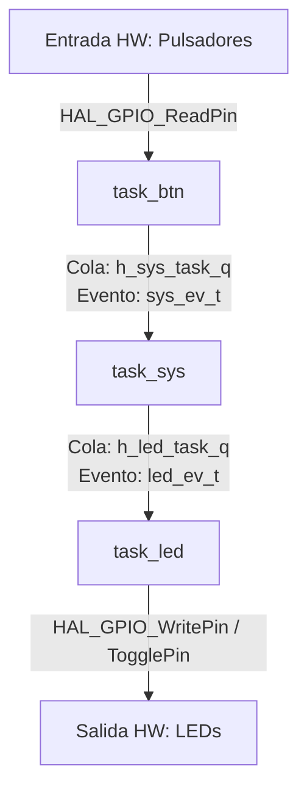

# Análisis y Explicación del Código Fuente - TP2 (Sistemas Orientados a Eventos - ETS)

**Asignatura:** Sistemas Operativos de Tiempo Real II (CESE - FIUBA / UTN)  
**Proyecto:** `sotrii-tp2_01-application`  
**Arquitectura:** RTOS - Event-Triggered Systems (ETS) con FreeRTOS  

---

## 1. Arquitectura General del Sistema

El proyecto implementa una arquitectura orientada a eventos (**Event-Triggered System - ETS**) sobre el sistema operativo de tiempo real **FreeRTOS**[cite: 4]. La aplicación gestiona la interacción entre botones de entrada (pulsadores) y la activación de LEDs de salida, empleando **Máquinas de Estados Finitos (Statecharts)** e interconectando las tareas mediante **Colas de Mensajes (Queues)** para la comunicación asíncrona entre hilos[cite: 1, 2, 3, 4].

### Diagrama Conceptual de Flujo

---

## 2. Archivos de Cabecera (Atributos y Definiciones)

Los archivos `.h` definen las estructuras de datos, identificadores, estados y eventos requeridos para modelar el comportamiento del sistema.

### 2.1. `task_btn_attribute.h`
Definiciones correspondientes a los botones del sistema:
- **Identificadores (`btn_id_t`):** Enumera los botones disponibles (`BTN_A`, `BTN_B`).
- **Eventos del Statechart (`btn_ev_t`):** `EV_BTN_UP` (botón liberado) y `EV_BTN_DOWN` (botón presionado).
- **Estados del Statechart (`btn_st_t`):** `ST_BTN_UP` y `ST_BTN_DOWN`.
- **Estructuras:**
  - `btn_t`: Mantiene la información del hardware (puerto GPIO, número de pin, estado actual del pin).
  - `btn_sc_t`: Mantiene el estado interno del Statechart (estado actual, evento de entrada `ev_in`, contador de *ticks*, evento de salida `ev_out`, y *ticks* transcurridos).
  - `h_btn_t`: Estructura *handler* que asocia la configuración del hardware (`btn_t`) con su correspondiente Statechart (`btn_sc_t`).

### 2.2. `task_sys_attribute.h`
Definiciones de la máquina de estados central del sistema:
- **Eventos del Sistema (`sys_ev_t`):**
  - `EV_SYS_OFF`: Mapeado directamente a `EV_BTN_UP`.
  - `EV_SYS_ON`: Mapeado directamente a `EV_BTN_DOWN`.
  - `EV_SYS_BLINK`: Evento para activar la intermitencia/destello.
  - `EV_SYS_NONE`: Ausencia de evento.
- **Estados del Sistema (`sys_st_t`):** `ST_SYS_IDLE`, `ST_SYS_ACTIVE_0`, `ST_SYS_ACTIVE_1`.
- **Estructuras:** `sys_sc_t` (datos del Statechart del sistema) y `h_sys_t` (*handler* principal).

### 2.3. `task_led_attribute.h`
Definiciones correspondientes a los LEDs actuadores:
- **Identificadores (`led_id_t`):** `LED_A`, `LED_B`, `LED_C`.
- **Eventos del LED (`led_ev_t`):**
  - `EV_LED_OFF` = `EV_SYS_OFF`
  - `EV_LED_ON` = `EV_SYS_ON`
  - `EV_LED_BLINK` = `EV_SYS_BLINK`
  - `EV_LED_NONE`
- **Estados del LED (`led_st_t`):** `ST_LED_OFF`, `ST_LED_ON`, `ST_LED_BLINK`.
- **Estructuras:** `led_t` (configuración HW de GPIO), `led_sc_t` (estado y temporizadores del LED) y `h_led_t` (*handler* de la tarea del LED).

---

## 3. Inicialización y Configuración de la Aplicación (`app.c`)

El archivo `app.c` actúa como el punto de entrada para la configuración del firmware bajo FreeRTOS mediante la función `app_init()`:

1. **Creación de Colas de Mensajes (*Queues*):**
   - `h_sys_task_q`: Cola de longitud 5 (`QUEUE_LENGTH_ = 5`) que transporta elementos de tipo `sys_ev_t`. Conecta la tarea de botones (`task_btn`) con la tarea del sistema (`task_sys`).
   - `h_led_task_q`: Cola de longitud 1 (`QUEUE_LENGTH__ = 1`) que transporta elementos de tipo `led_ev_t`. Conecta la tarea del sistema (`task_sys`) con la tarea del LED (`task_led`).
2. **Creación de Tareas FreeRTOS (`xTaskCreate`):**
   - **`Task A` y `Task B`:** Tareas genéricas creadas con prioridad `tskIDLE_PRIORITY + 2`.
   - **`Task Led` (`task_led`):** Prioridad `tskIDLE_PRIORITY + 1`, recibe `&h_led` como parámetro.
   - **`Task Sys` (`task_sys`):** Prioridad `tskIDLE_PRIORITY + 1`, recibe `&h_sys` como parámetro.
   - **`Task Btn` (`task_btn`):** Prioridad `tskIDLE_PRIORITY + 1`, recibe `&h_btn` como parámetro.
3. **Inicialización de Periféricos e Interrupciones:** Llama a `app_it_init()` para habilitar las interrupciones de la aplicación e inicializa el contador de ciclos DWT (`cycle_counter_init()`).

---

## 4. Descripción Detallada de las Tareas (`.c`)

### 4.1. Tarea de Botones (`task_btn.c`)
- **Frecuencia de Ejecución:** Bucle infinito ejecutado periódicamente cada 50 ms (`vTaskDelay(pdMS_TO_TICKS(50))`).
- **Funcionamiento:**
  1. Lee el estado físico del GPIO mediante `HAL_GPIO_ReadPin()`.
  2. Determina el evento de entrada (`EV_BTN_DOWN` si está presionado, `EV_BTN_UP` si no).
  3. Ejecuta la función `task_btn_statechart()`.
- **Lógica de Statechart (`task_btn_statechart`):**
  - Si está en `ST_BTN_UP` y recibe `EV_BTN_DOWN`: Transiciona a `ST_BTN_DOWN` y envía `EV_BTN_DOWN` a la cola `h_sys_task_q` utilizando `xQueueSend()`.
  - Si está en `ST_BTN_DOWN` y recibe `EV_BTN_UP`: Transiciona a `ST_BTN_UP` y envía `EV_BTN_UP` a la cola `h_sys_task_q`.

### 4.2. Tarea del Sistema (`task_sys.c`)
- **Frecuencia de Ejecución:** Periodo de 50 ms (`vTaskDelay`).
- **Funcionamiento:**
  1. Consulta la cola `h_sys_task_q` mediante `xQueueReceive()` con tiempo de espera cero (`TickType_t ZERO`).
  2. Si no hay elementos en la cola, asume el evento `EV_SYS_NONE`.
  3. Ejecuta `task_sys_statechart()`.
- **Lógica de Statechart (`task_sys_statechart`):**
  - **`ST_SYS_IDLE`:** Al recibir `EV_SYS_ON`, conmuta al estado `ST_SYS_ACTIVE_0` y envía el evento `EV_SYS_ON` a la cola `h_led_task_q`.
  - **`ST_SYS_ACTIVE_0`:** Al recibir nuevamente `EV_SYS_ON`, conmuta al estado `ST_SYS_ACTIVE_1` y envía el evento `EV_SYS_BLINK` a la cola `h_led_task_q`.
  - **`ST_SYS_ACTIVE_1`:** Al recibir por tercera vez `EV_SYS_ON`, regresa al estado `ST_SYS_IDLE` y envía el evento `EV_SYS_OFF` a la cola `h_led_task_q`.

### 4.3. Tarea de LEDs (`task_led.c`)
- **Frecuencia de Ejecución:** Periodo de 50 ms (`vTaskDelay`).
- **Funcionamiento:**
  1. Consulta la cola `h_led_task_q` mediante `xQueueReceive()`. Si no hay nuevo evento, asigna `EV_LED_NONE`.
  2. Ejecuta `task_led_statechart()`.
- **Lógica de Statechart (`task_led_statechart`):**
  - **Manejo de `EV_LED_OFF`:** Configura el estado a `ST_LED_OFF`, fuerza el pin a `LED_OFF` con `HAL_GPIO_WritePin()` y reinicia el contador de ticks.
  - **Manejo de `EV_LED_ON`:** Configura el estado a `ST_LED_ON`, fuerza el pin a `LED_ON` con `HAL_GPIO_WritePin()` y reinicia el contador de ticks.
  - **Manejo de `EV_LED_BLINK`:**
    - Ingresa o se mantiene en el estado `ST_LED_BLINK`.
    - Realiza una temporización no bloqueante basada en el periodo de la tarea (50 ms).
    - Cada vez que transcurren 500 ms (`DEL_LED_BLINK`), conmuta el estado del pin mediante `HAL_GPIO_TogglePin()` y reinicia la cuenta.

---

## 5. Resumen de Transiciones y Ciclo de Vida del Sistema

| Acción del Usuario | Estado del Sistema (`task_sys`) | Evento Enviado al LED (`h_led_task_q`) | Estado / Acción del LED (`task_led`) |
| :--- | :--- | :--- | :--- |
| **Estado Inicial** | `ST_SYS_IDLE` | `EV_SYS_OFF` | `ST_LED_OFF` (LED Apagado) |
| **1ª Presión del Botón** | Transiciona a `ST_SYS_ACTIVE_0` | `EV_SYS_ON` | Transiciona a `ST_LED_ON` (Encendido Fijo) |
| **2ª Presión del Botón** | Transiciona a `ST_SYS_ACTIVE_1` | `EV_SYS_BLINK` | Transiciona a `ST_LED_BLINK` (Parpadeo a 500 ms) |
| **3ª Presión del Botón** | Regresa a `ST_SYS_IDLE` | `EV_SYS_OFF` | Regresa a `ST_LED_OFF` (LED Apagado) |