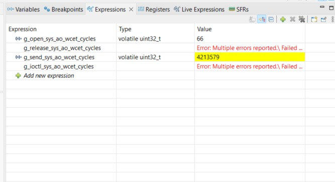

# TP2-02 - Active Object Sys

## Medición de WCET de las funciones de interfaz

Las mediciones se realizaron con el contador de ciclos DWT y se observaron
desde el depurador de STM32CubeIDE. La conversión utilizada es:

```text
Tiempo [µs] = ciclos de clock / 16
```



| Función de interfaz | Variable observada | Ciclos de clock | Tiempo [µs] |
| :--- | :--- | ---: | ---: |
| `open_sys_ao()` | `g_open_sys_ao_wcet_cycles` | 66 | 4,1250 |
| `send_sys_ao()` | `g_send_sys_ao_wcet_cycles` | 4213579 | 263348,6875 |
| `release_sys_ao()` | `g_release_sys_ao_wcet_cycles` | No ejecutada | No medido |
| `ioctl_sys_ao()` | `g_ioctl_sys_ao_wcet_cycles` | No ejecutada | No medido |

```text
open_sys_ao(): 66 / 16 = 4,125 µs
send_sys_ao(): 4213579 / 16 = 263348,6875 µs
```

`release_sys_ao()` e `ioctl_sys_ao()` no se llaman durante el flujo normal de
la aplicación. Por ese motivo no se ejecutó su instrumentación y no se obtuvo
una medición. 

El tiempo de `send_sys_ao()` incluye la espera hasta que la tarea gatekeeper
procesa el mensaje y confirma la operación, debido al patrón síncrono.

