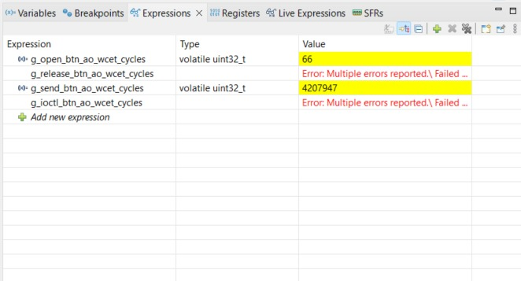

# TP2-03 - Active Object Btn

## Medición de WCET de las funciones de interfaz

Las mediciones se realizaron con el contador de ciclos DWT y se observaron
desde el depurador de STM32CubeIDE. La conversión utilizada es:

```text
Tiempo [µs] = ciclos de clock / 16
```



| Función de interfaz | Variable observada | Ciclos de clock | Tiempo [µs] |
| :--- | :--- | ---: | ---: |
| `open_btn_ao()` | `g_open_btn_ao_wcet_cycles` | 66 | 4,1250 |
| `send_btn_ao()` | `g_send_btn_ao_wcet_cycles` | 4207947 | 262996,6875 |
| `release_btn_ao()` | `g_release_btn_ao_wcet_cycles` | No ejecutada | No medido |
| `ioctl_btn_ao()` | `g_ioctl_btn_ao_wcet_cycles` | No ejecutada | No medido |

```text
open_btn_ao(): 66 / 16 = 4,125 µs
send_btn_ao(): 4207947 / 16 = 262996,6875 µs
```

`release_btn_ao()` e `ioctl_btn_ao()` no se llaman durante el flujo normal de
la aplicación. Por ese motivo no se ejecutó su instrumentación y no se obtuvo
una medición. 

El tiempo de `send_btn_ao()` incluye el envío de “evento y tiempo” y la espera
de la confirmación de `task_sys`, debido al patrón síncrono.

