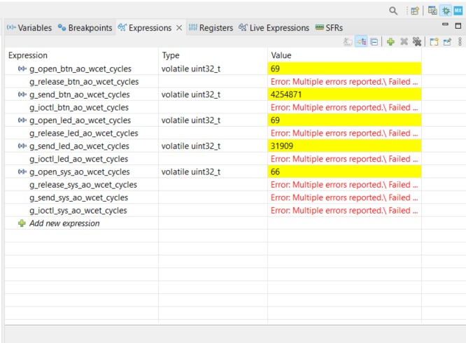

# TP2-04 - Active Object Application

## Medición de WCET de las funciones de interfaz

Las mediciones se realizaron con el contador de ciclos DWT y se observaron
desde el depurador de STM32CubeIDE. La conversión utilizada es:

```text
Tiempo [µs] = ciclos de clock / 16
```



### Active Object Btn

| Función de interfaz | Variable observada | Ciclos de clock | Tiempo [µs] |
| :--- | :--- | ---: | ---: |
| `open_btn_ao()` | `g_open_btn_ao_wcet_cycles` | 69 | 4,3125 |
| `send_btn_ao()` | `g_send_btn_ao_wcet_cycles` | 4254871 | 265929,4375 |
| `release_btn_ao()` | `g_release_btn_ao_wcet_cycles` | No ejecutada | No medido |
| `ioctl_btn_ao()` | `g_ioctl_btn_ao_wcet_cycles` | No ejecutada | No medido |

### Active Object Led

| Función de interfaz | Variable observada | Ciclos de clock | Tiempo [µs] |
| :--- | :--- | ---: | ---: |
| `open_led_ao()` | `g_open_led_ao_wcet_cycles` | 69 | 4,3125 |
| `send_led_ao()` | `g_send_led_ao_wcet_cycles` | 31909 | 1994,3125 |
| `release_led_ao()` | `g_release_led_ao_wcet_cycles` | No ejecutada | No medido |
| `ioctl_led_ao()` | `g_ioctl_led_ao_wcet_cycles` | No ejecutada | No medido |

### Active Object Sys

| Función de interfaz | Variable observada | Ciclos de clock | Tiempo [µs] |
| :--- | :--- | ---: | ---: |
| `open_sys_ao()` | `g_open_sys_ao_wcet_cycles` | 66 | 4,1250 |
| `send_sys_ao()` | `g_send_sys_ao_wcet_cycles` | No ejecutada | No medido |
| `release_sys_ao()` | `g_release_sys_ao_wcet_cycles` | No ejecutada | No medido |
| `ioctl_sys_ao()` | `g_ioctl_sys_ao_wcet_cycles` | No ejecutada | No medido |

Los cálculos de los valores medidos son:

```text
open_btn_ao():  69 / 16 = 4,3125 µs
send_btn_ao():  4254871 / 16 = 265929,4375 µs
open_led_ao():  69 / 16 = 4,3125 µs
send_led_ao():  31909 / 16 = 1994,3125 µs
open_sys_ao():  66 / 16 = 4,125 µs
```

Las interfaces marcadas como “No ejecutada” no se llaman durante el flujo
observado. Por ese motivo no se ejecutó su instrumentación y no se obtuvo una
medición. 

Los tiempos de las interfaces `send` incluyen la espera de la confirmación de
la tarea gatekeeper correspondiente, debido al patrón síncrono.

